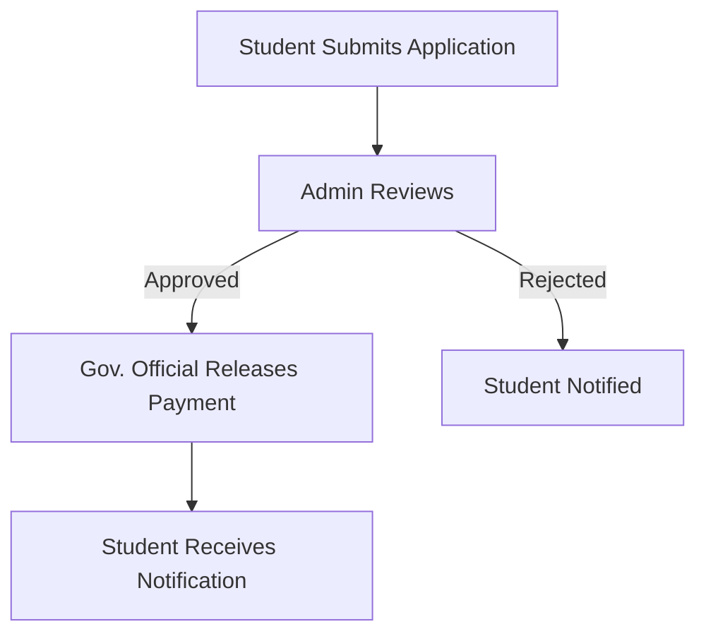

# 🎓 Scholarship Portal

A **comprehensive web platform** to manage student scholarships with secure authentication, multiple user roles, document uploads, and automated notifications — built for scale, transparency, and efficiency.

---

## 📌 Overview

The **Scholarship Portal** is a full-stack web application designed to simplify and digitize the entire scholarship disbursement process. From student applications to administrator reviews and government payment releases, the system offers an **end-to-end solution** with intuitive workflows and powerful features.

---

## 👥 User Roles

| Role               | Responsibilities                                                                 |
|--------------------|----------------------------------------------------------------------------------|
| 🎓 **Students**     | Submit scholarship applications and upload necessary documents                  |
| 🛠 **Administrators** | Review, approve, or reject applications via an admin dashboard                 |
| 🏛 **Gov. Officials** | Manage disbursement of payments for approved applications                      |

---

## 🚀 Key Features

- 🔐 **Secure Role-Based Authentication** using JWT
- 📂 **Document Upload System** (e.g., marksheets, certificates)
- 📬 **Automated Email Notifications** for each application stage
- 🆔 **Unique Application ID** tracking
- 📊 **Admin Dashboard** for reviewing and managing applications
- 💸 **Gov Dashboard** to approve and release scholarship payments

---

## 🛠 Tech Stack

**Backend**
- 🟢 Node.js + Express.js
- 🗄 MongoDB with Mongoose ORM
- 🔒 JWT Authentication & Bcrypt Password Hashing
- 📤 Multer for File Uploads
- 📧 Nodemailer with Hostinger SMTP

**Core Dependencies**
```bash
express        # Web framework  
mongoose       # MongoDB ORM  
jsonwebtoken  # JWT auth  
bcryptjs       # Password hashing  
multer         # File uploads  
nodemailer     # Email service  
dotenv         # Environment management  
cors           # Cross-origin resource sharing  
morgan         # Logging middleware
````

---

## 📁 Project Structure

```
server/
├── config/          # DB and server configs
├── controllers/     # Business logic & route handlers
├── middleware/      # Auth & role-based access
├── models/          # Mongoose schemas
├── routes/          # All API routes
├── services/        # Email & external services
├── uploads/         # Stored files
├── .env             # Environment variables
└── index.js         # App entry point
```

---

## ⚙️ Installation & Setup

### ✅ Prerequisites

* Node.js (v14+)
* MongoDB (local or Atlas)
* npm or yarn

### 🚧 Steps

```bash
# Clone the repo
git clone https://github.com/yourusername/scholarship-portal.git
cd scholarship-portal

# Install dependencies
npm install

# Create environment file
touch .env
```

`.env`

```env
PORT=5000
MONGO_URI=mongodb://localhost:27017/scholarship-portal
JWT_SECRET=your_jwt_secret_key_here
EMAIL_USER=noreply@yourdomain.com
EMAIL_PASS=your_email_password_here
```

```bash
# Create uploads directory
mkdir uploads

# Run the server
npm start
```

---

## 🔌 API Endpoints

### 🔐 Authentication

| Endpoint              | Method | Description           |
| --------------------- | ------ | --------------------- |
| `/api/users/register` | POST   | Register new user     |
| `/api/users/login`    | POST   | Login and receive JWT |

### 📄 Applications

| Endpoint                           | Method | Description             |
| ---------------------------------- | ------ | ----------------------- |
| `/api/applications`                | POST   | Submit new application  |
| `/api/applications/:applicationId` | GET    | View application status |
| `/api/applications/past`           | GET    | Fetch past applications |

### 🛠 Admin

| Endpoint                              | Method | Description           |
| ------------------------------------- | ------ | --------------------- |
| `/api/admin/applications`             | GET    | View all pending apps |
| `/api/admin/applications/:id/approve` | POST   | Approve application   |
| `/api/admin/applications/:id/reject`  | POST   | Reject application    |

### 🏛 Government Officials

| Endpoint                                    | Method | Description                 |
| ------------------------------------------- | ------ | --------------------------- |
| `/api/gov/approved-applications`            | GET    | View apps awaiting payment  |
| `/api/gov/applications/:id/release-payment` | POST   | Release scholarship payment |

---

## 📄 File Upload Requirements

Students must upload the following documents:

* ✅ 12th Grade Marksheet
* ✅ Family Income Certificate
* ✅ First Page of Bank Passbook
* ✅ Aadhaar Card (Front Page)

---

## 📬 Email Notifications

Users receive automatic email updates for:

* Application submission
* Approval or rejection
* Scholarship payment release

---

## 🔐 Security Highlights

* ✅ JWT-based authentication system
* ✅ Role-based route protection
* ✅ Secure password storage with bcrypt
* ✅ Input sanitization and access control middleware

---

## 🧠 Application Workflow



---

## 🧩 Role Access Summary

| Role          | Email Format           |
| ------------- | ---------------------- |
| Student       | Any email              |
| Admin         | Ends with `@admin.com` |
| Gov. Official | Ends with `@gov.com`   |

---

## 🤝 Contributing

```bash
# Fork the repository
# Create a new feature branch
# Commit and push your changes
# Open a pull request
```

We welcome issues, feature suggestions, and improvements from the community!

---

## 📄 License

MIT License. Feel free to use and modify the project for learning or production purposes.

---

> Built with ❤️ by [Ujjwal Jha](https://www.linkedin.com/in/ujjwaljha1)
> 🔗 [Portfolio](https://ujjwaljha.in) | [Twitter](https://twitter.com/ujjwaljha1)

```
